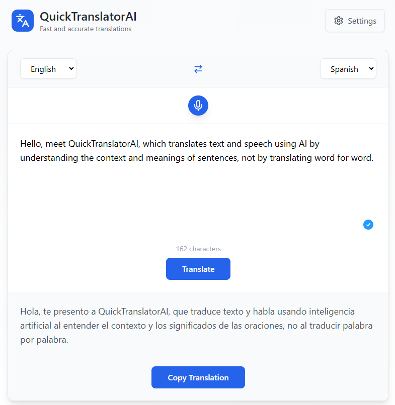

# QuickTranslatorAI 🌐

A powerful, real-time translation application powered by artificial intelligence that supports voice recording, text input, and seamless translations across multiple languages.



## 🤖 More Than Just Translation

- **Contextual Understanding**: Analyzes the full context of your text, not just individual words
- **Intent Preservation**: Captures and maintains the writer's original intention
- **Style Matching**: Preserves the author's personal writing style in the translation
- **Natural Output**: Produces translations that sound natural and fluid in the target language
- **Tone Recognition**: Understands and maintains the emotional tone of the original text
- **Cultural Adaptation**: Makes appropriate cultural adjustments while preserving meaning

## 🌟 Key Features

- 🎙️ Voice Recording with Audio Visualization
- 🔄 Real-time Smart Translation
- 📝 Text Input Support
- 🌍 Multiple Language Support (Hebrew, English, Spanish, French, German, Italian, Russian, Arabic)
- 🎨 Modern, Responsive UI with RTL Support
- ⚡ PWA Support with Offline Capabilities
- 🔒 Secure API Key Management
- 📊 Real-time Audio Visualization

## 🛠️ Technical Stack

- React.js
- OpenAI API Integration
- Web Audio API
- Progressive Web App (PWA)
- Docker Support
- Service Workers for Offline Functionality

## 🚀 Installation

### Using Docker

#### Option 1: Docker Compose (Recommended)
```yaml
version: '3.7'
services:
  translator-ai:
    image: aviv943/quick-translator-ai:latest
    container_name: quick-translator-ai
    ports:
      - "8965:80"
```

Run with:
```bash
docker-compose up -d
```

#### Option 2: Docker Run Command
```bash
docker run -d \
  --name quick-translator-ai \
  -p 8965:80 \
  aviv943/quick-translator-ai:latest
```

Both methods will:
- Pull the image from Docker Hub
- Run the container in detached mode (-d)
- Map port 8965 on your host to port 80 in the container
- Name the container "quick-translator-ai"

To stop the container:
```bash
# If using docker-compose:
docker-compose down

# If using docker run:
docker stop quick-translator-ai
docker rm quick-translator-ai
```

### Manual Installation

1. Clone the repository:
```bash
git clone https://github.com/yourusername/quick-translator-ai.git
cd quick-translator-ai
```

2. Install dependencies:
```bash
npm install
```

5. Start the development server:
```bash
npm start
```

## ⚙️ Configuration

1. Access the settings through the UI
2. Configure:
    - OpenAI API Key (**❗required❗**)
    - AI Model selection
    - Recording time limit
    - Text case preferences
    - Transcription review options

## 🎯 Usage

1. Select source and target languages
2. Input text either by:
    - Using the microphone button to record speech
    - Typing directly in the text area
3. Click "Translate" or press Enter
4. Copy the translated text using the "Copy Translation" button

## 🔑 Key Features Explained

- **Voice Recording**: Record audio with real-time visualization
- **Language Swap**: Easily switch between source and target languages
- **RTL Support**: Full support for right-to-left languages
- **Offline Capability**: Works offline for previously cached content
- **Responsive Design**: Works on all device sizes
- **Audio Visualization**: Real-time audio feedback during recording

## 🤝 Contributing

Contributions are welcome! Please feel free to submit a Pull Request.

## 📄 License

This project is licensed under the MIT License - see the LICENSE file for details.

## 🔧 Troubleshooting

- Ensure microphone permissions are granted for voice recording
- Check API key configuration if translations fail
- Verify internet connection for real-time translations
- Clear cache if PWA updates aren't reflected

## 📞 Support

For support, please open an issue in the GitHub repository or contact the maintenance team.

---

Made with ❤️ by the QuickTranslatorAI Team
